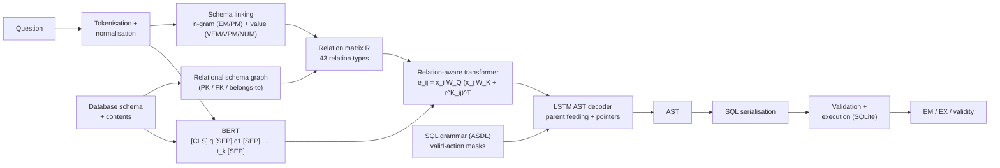

# RAT-SQL: Schema-Aware Text-to-SQL — a research re-implementation

A from-scratch, research-grade re-implementation of **RAT-SQL** (Wang et al., ACL 2020,
*“Relation-Aware Schema Encoding and Linking for Text-to-SQL Parsers”*) with explicit relational
schema graphs, n-gram and value-based schema linking, BERT contextual representations, a
relation-aware transformer, a grammar-constrained LSTM AST decoder, and a complete experimental
study on the Spider benchmark: baselines, controlled ablations, data scaling, complexity and error
analysis, attention analysis, and an independent re-implementation of Spider's exact-match metric
that is cross-checked against the official evaluator.

> **Honesty note.** Every number in this repository was produced by the code in this repository
> on a single laptop GPU (RTX 3050, 6 GB) and is read from saved metric files. Numbers quoted from
> the RAT-SQL paper are always labelled *paper* and are never mixed with ours. Our models use
> BERT-small/-medium and a few-hour training budget, far below the paper's BERT-large / 90k-step
> setting, so our absolute accuracy is lower than the paper's.

<!-- RESULTS:headline:start -->
### Headline results (our measurements; generated from `experiments/*/…_metrics.json`)

| Model | Spider split | Exact Match | Execution Accuracy | Executable SQL | Training |
|---|---|---|---|---|---|
| Final model — BERT-medium + RAT + linking + grammar | dev (1,034) | **64.9 %** | **66.9 %** | 90.0 % | 40 epochs, 101 min |
| Final model — BERT-medium + RAT + linking + grammar | test (2,147) | **59.3 %** | **63.4 %** | 88.6 % | 40 epochs, 101 min |
| Controlled FULL — BERT-small + RAT + linking + grammar | dev (1,034) | 61.4 % | 63.7 % | 92.4 % | 20 epochs, 52 min |
| RAT-SQL + BERT-large (*paper*, not ours) | dev / test | 69.7 % / 65.6 % | – | – | 90k updates |

* Our exact-match implementation agrees with the official Spider evaluator on **every** checked
  prediction (1,034 dev, 2,147 test) — see the cross-check table below.
* Controlled ablations (same data, budget and seed) — full table in [Results](#8-results):
  relation-aware → vanilla attention, no schema-linking relations, coarse relation vocabulary and no
  grammar constraints each cost a large, statistically clear amount of accuracy or validity.
<!-- RESULTS:headline:end -->

---

## Contents

1. [Motivation and research question](#1-motivation-and-research-question)
2. [Architecture](#2-architecture)
3. [Method](#3-method)
4. [Dataset](#4-dataset)
5. [Installation](#5-installation)
6. [Training and evaluation](#6-training-and-evaluation)
7. [Baselines and experiments](#7-baselines-and-experiments)
8. [Results](#8-results)
9. [Limitations](#9-limitations)
10. [Reproducibility](#10-reproducibility)
11. [Project structure](#11-project-structure)

## 1. Motivation and research question

Spider evaluates Text-to-SQL on **databases never seen during training**. A parser therefore has to
(i) link question phrases to the right tables, columns and cell values of an unfamiliar schema and
(ii) exploit the schema's structure (column ∈ table, primary / foreign keys) to build joins.
RAT-SQL encodes both as *relations* inside self-attention.

**Research question.** *How can explicit relational schema representation, schema linking,
relation-aware attention and grammar-constrained decoding improve natural-language-to-SQL
generation and generalisation across unseen database schemas?* Concretely we measure:

* Does schema linking help? Which kind — name (n-gram) or value (database content) linking?
* Does relation-aware attention beat vanilla attention with the same capacity?
* Which schema relations matter (foreign keys; fine-grained vs coarse relation types)?
* Does grammar-constrained decoding improve SQL validity?
* How does accuracy change with query complexity and with less training data?
* Where does the model fail?

## 2. Architecture



```
question ─► tokens ─► schema linking ─┐
schema ───► schema graph ─────────────┴─► relation matrix R (N×N)
question+schema ─► BERT ─► x ─► relation-aware transformer(x, R) ─► memory
memory ─► LSTM tree decoder ─(grammar mask)─► actions ─► AST ─► SQL ─► execute
```

## 3. Method

| Component | Implementation | Code |
|---|---|---|
| Schema model | tables, columns (`*` included), types, primary / foreign keys from `tables.json` | `src/ratsql/schema/schema.py` |
| Relational schema graph | typed edges: `ct_primary_key`, `ct_belongs_to`, `ct_foreign_key`, `cc_same_table`, `cc_fk_forward/backward`, `tt_fk_forward/backward/both`, `*`→any table | `schema/graph.py` (`SchemaGraph`) |
| Relation vocabulary / matrix | 43 types (RAT-SQL Table 1 + implementation relations) or 6 coarse types; N×N matrix over `[question | columns | tables]` | `schema/relations.py` (`RelationVocabulary`, `RelationMatrixBuilder`) |
| N-gram linking | normalised 1–5-grams; exact (`EM`) and partial (`PM`) name matches, case/plural-insensitive | `schema/linking.py` |
| Value linking | DB cell-value index; exact n-gram (`VEM`), word-in-value (`VPM`), number↔numeric column (`NUM`); debug view *phrase → table / column / value* | `schema/db_values.py`, `schema/linking.py` |
| BERT representation | one BERT pass over question + all schema names; mean-pooled word pieces; long schemas chunked | `models/encoders.py` |
| Relation-aware transformer | relation embeddings added to keys and values; efficient gather/scatter form verified against the literal formula | `models/rat.py` |
| LSTM AST decoder | parent feeding, multi-head attention, rule MLP, memory-aligned column/table pointers, value pointer | `models/decoder.py` |
| Grammar constraints | ASDL grammar of Spider SQL (20 composite + 3 primitive types, 49 constructors); invalid actions masked at every step | `sql/grammar.py`, `sql/transition.py` |
| SQL serialisation / parsing | AST ↔ Spider dict ↔ SQL; parser re-implements Spider's `process_sql` | `sql/ast.py`, `sql/serializer.py`, `sql/parser.py` |
| Metrics | Exact Match (official semantics, cross-checked), Execution Accuracy, SQL validity, components, hardness | `evaluation/` |
| Analyses | error taxonomy, clause accuracy, complexity, linking, attention | `analysis/` |

Full equations, design decisions and **every simplification** are documented in
[`reports/methodology.md`](reports/methodology.md).

### Relation-aware self-attention

```
e_ij = x_i W_Q (x_j W_K + r^K_ij)^T / sqrt(d_z / H)        α_ij = softmax_j(e_ij)
z_i  = Σ_j α_ij (x_j W_V + r^V_ij)                          y_i = LayerNorm(x_i + z_i) → FFN → LayerNorm
```

### Schema-linking example (synthetic running example)

```
Which employees work in Hyderabad?
  'employees' -> TABLE employee [EM]
  'employees' -> COLUMN employee.emp_id [PM]
  'Hyderabad' -> COLUMN employee.city [VEM]
  'Hyderabad' -> VALUE 'Hyderabad' in employee.city [VEM]
predicted:  SELECT name FROM employee WHERE city = 'Hyderabad'      (tests/test_end_to_end.py)
```

## 4. Dataset

Spider (CC BY-SA 4.0) is **not** redistributed. `scripts/download_data.py` downloads the official
archive from the link on the Spider website, extracts it into `data/raw/` and validates it
(8,659 train / 1,034 dev / 2,147 test examples, 206 databases). See [`data/README.md`](data/README.md).

| Split | Examples | Databases | Role |
|---|---|---|---|
| train | 8,280 | 138 | training (`train_spider` + `train_others` minus validation DBs) |
| val | 379 | 8 | checkpoint selection (held-out *training* databases) |
| dev | 1,034 | 20 | **reported results** |
| test | 2,147 | 40 | final model only |

No database is shared between splits. Preprocessing checks: our SQL parser reproduces Spider's
`sql` field for 100 % of dev/test queries; every gold query converts to a grammar AST and back to
an exact match of itself; executing these oracle ASTs gives 95.0 % EX on dev (the ceiling of our
value-candidate design, limited by literals that do not appear in the question).

A small synthetic Spider-format dataset (`data/samples/synthetic`, 5 toy databases) is used for
DEBUG mode and tests.

## 5. Installation

```bash
python -m venv .venv && source .venv/bin/activate        # Windows: .venv\Scripts\activate
pip install torch --index-url https://download.pytorch.org/whl/cu126   # or the CPU wheel
pip install -r requirements.txt
pip install -e .                                          # optional: installs the `ratsql` package
python scripts/download_data.py --dataset all             # Spider + synthetic data
python -m pytest tests                                    # 60+ unit / integration / end-to-end tests
```

Tested with Python 3.13, PyTorch 2.14 (CUDA 12.6), transformers 5.17 on Windows 11. CPU works for
DEBUG mode; GPU is strongly recommended for Spider.

## 6. Training and evaluation

```bash
# DEBUG: synthetic data, BERT-tiny, a few minutes on CPU
python scripts/preprocess.py --config configs/debug.yaml
python scripts/train.py --config configs/debug.yaml --eval-splits dev

# SMALL (controlled setting): full Spider train, BERT-small, 20 epochs
python scripts/preprocess.py --config configs/small.yaml --oracle-exec
python scripts/train.py --config configs/small.yaml --output-dir experiments/full_model/full --eval-splits dev

# FULL: BERT-medium, 40 epochs, dev + test
python scripts/train.py --config configs/full.yaml --eval-splits dev test

# evaluation / inference
python scripts/evaluate.py --checkpoint experiments/full_model/full/best.pt --split dev [--beam-size 5]
python scripts/predict.py --checkpoint experiments/full_model/final/best.pt --db-id concert_singer \
       --question "How many singers do we have?" --show-ast
```

Every run writes `config.json`, `run_info.json` (parameter counts, versions, seed), `train.log`,
`history.json`, `best.pt`/`last.pt` (resumable with `--resume`), `dev_metrics.json` and
per-example `dev_predictions.jsonl`. Overrides: `--set train.epochs=5 model.rat.num_layers=2`.

## 7. Baselines and experiments

| ID | Experiment | Change w.r.t. FULL |
|---|---|---|
| Baseline A | simple schema-aware model | BiLSTM encoder (static BERT word-piece embeddings), no RAT layers, no linking |
| Baseline B = F | vanilla transformer | same layers, relation embeddings removed |
| Baseline C = B | no schema linking | all question–schema link relations removed |
| A | **FULL** | BERT-small + 4 RAT layers + linking + grammar |
| C | no n-gram linking | EM/PM name-link relations removed |
| D | no value linking | VEM/VPM cell-value relations removed |
| E | no RAT | BERT output fed directly to the decoder |
| G | no foreign keys | FK relations mapped to defaults |
| H | no grammar constraints | unmasked softmax over all actions (train + decode) |
| H2-ref / H2 | grammar ablation with direct pointers | unnormalised bilinear pointers, with / without the grammar mask (controls for the pointer parameterisation) |
| I | simpler encoder | BiLSTM instead of BERT, RAT + linking kept |
| J | less data | 1 / 5 / 10 / 25 / 50 % of training data |
| K | coarse relations | 6 undirected relation types instead of 43 |

All rows share data, seed, budget (20 epochs) and checkpoint selection on validation databases.
Run everything with `python scripts/run_ablation.py` (registry: `configs/experiments.yaml`).

Additional studies: a synthetic relational-reasoning task isolating relation-aware vs vanilla
attention (`scripts/run_synthetic_relation_experiment.py`), attention analysis by relation type
(`scripts/run_attention_analysis.py`), error taxonomy / clause accuracy / complexity analysis
(`scripts/run_error_analysis.py`), official-evaluator cross-check (`scripts/official_eval_crosscheck.py`).

## 8. Results

<!-- RESULTS:body:start -->
All tables below are generated from saved metric files (`scripts/collect_results.py`,
`scripts/build_report.py`). Full discussion: [`reports/RAT_SQL_REPORT.md`](reports/RAT_SQL_REPORT.md);
all tables: [`reports/experiment_results.md`](reports/experiment_results.md); per-run status and
provenance: [`PROJECT_STATUS.md`](PROJECT_STATUS.md).

#### Main results (our measurements)

All numbers are measured by this repository on the Spider **dev** set (1,034 examples, 20 unseen databases) unless a Split column says test (2,147 examples, 40 unseen databases). Controlled setting (all rows except Final): BERT-small encoder, identical training budget and data; checkpoints selected on held-out *training* databases. SQL validity = fraction of predictions that execute without error.

| Model | Split | Exact Match (%) | EM 95% CI | Execution Accuracy (%) | EX 95% CI | SQL Validity (%) | Params | Train (min) |
|---|---|---|---|---|---|---|---|---|
| Baseline A: BiLSTM schema encoder + grammar decoder (no BERT, no RAT, no linking) | dev | 9.6 | [7.8, 11.3] | 10.0 | [8.2, 11.7] | 31.7 | 22,206,770 | 41.5 |
| Baseline B: vanilla transformer (no relation-aware attention) | dev | 33.1 | [30.4, 36.0] | 31.4 | [28.7, 34.3] | 54.7 | 37,056,562 | 53.4 |
| Baseline C: schema-aware RAT without schema linking | dev | 48.7 | [45.6, 51.7] | 53.0 | [49.7, 56.0] | 88.0 | 37,067,826 | 57.7 |
| FULL: BERT + RAT + schema linking + grammar decoding | dev | 61.4 | [58.4, 64.3] | 63.7 | [60.6, 66.5] | 92.4 | 37,067,826 | 51.8 |
| Final: FULL with BERT-medium, 40 epochs | dev | 64.9 | [62.0, 67.7] | 66.9 | [64.1, 69.9] | 90.0 | 49,677,362 | 101.3 |
| Final: FULL with BERT-medium, 40 epochs | test | 59.3 | [57.3, 61.5] | 63.4 | [61.4, 65.5] | 88.6 | 49,677,362 | 101.3 |

#### Agreement with the official Spider evaluator (`results/metrics/official_crosscheck_*.json`)

| Predictions | Examples | EM (ours) | EM (official) | EM agreement | EX (ours, strict) | EX (official test-suite exec.) | EX agreement |
|---|---|---|---|---|---|---|---|
| controlled FULL, dev | 1,034 | 61.41 | 61.41 | 100.0 % | 63.73 | 64.51 | 98.5 % |
| final model, dev | 1,034 | 64.89 | 64.89 | 100.0 % | 66.92 | 68.09 | 98.6 % |
| final model, test | 2,147 | 59.34 | 59.34 | 100.0 % | 63.44 | 64.28 | 98.9 % |

Our EX keeps `DISTINCT`; the official test-suite executor strips it, hence its slightly higher EX.

#### Ablations (our measurements)

All numbers are measured by this repository on the Spider **dev** set (1,034 examples, 20 unseen databases) unless a Split column says test (2,147 examples, 40 unseen databases). Controlled setting (all rows except Final): BERT-small encoder, identical training budget and data; checkpoints selected on held-out *training* databases. SQL validity = fraction of predictions that execute without error. ΔEM/ΔEX are differences to the FULL row; 95 % CIs from a paired bootstrap over dev examples (2,000 resamples) capture dev-set sampling noise but not training-seed variance.

| ID | Experiment | EM (%) | EX (%) | SQL valid (%) | Well-formed AST (%) | ΔEM (pts) | ΔEM 95% CI | ΔEX (pts) | ΔEX 95% CI | Params | Train (min) | Infer (ms/ex) |
|---|---|---|---|---|---|---|---|---|---|---|---|---|
| A | FULL: BERT + RAT + schema linking + grammar decoding | 61.4 | 63.7 | 92.4 | 100.0 | 0.0 | – | 0.0 | – | 37,067,826 | 51.8 | 22.98 |
| B | Baseline C: schema-aware RAT without schema linking | 48.7 | 53.0 | 88.0 | 99.8 | -12.7 | [-15.5, -10.0] | -10.7 | [-13.2, -8.3] | 37,067,826 | 57.7 | 27.43 |
| C | No n-gram (name) linking | 54.3 | 55.7 | 89.6 | 100.0 | -7.2 | [-9.9, -4.4] | -8.0 | [-10.6, -5.4] | 37,067,826 | 40.9 | 10.26 |
| D | No value (cell) linking | 58.3 | 60.5 | 88.6 | 100.0 | -3.1 | [-5.6, -0.8] | -3.2 | [-5.6, -0.8] | 37,067,826 | 37.2 | 10.15 |
| E | No relation-aware transformer (BERT output fed to decoder) | 31.8 | 32.2 | 54.6 | 100.0 | -29.6 | [-32.8, -26.3] | -31.5 | [-34.7, -28.2] | 33,897,010 | 31.4 | 9.89 |
| F | Baseline B: vanilla transformer (no relation-aware attention) | 33.1 | 31.4 | 54.7 | 100.0 | -28.3 | [-31.3, -25.4] | -32.3 | [-35.4, -29.2] | 37,056,562 | 53.4 | 23.63 |
| G | No foreign-key relations | 60.2 | 60.0 | 91.1 | 100.0 | -1.3 | [-3.9, +1.5] | -3.8 | [-6.2, -1.2] | 37,067,826 | 36.6 | 10.66 |
| H | No grammar constraints (unmasked action softmax) | 20.9 | 21.7 | 26.2 | 27.1 | -40.5 | [-43.7, -37.4] | -42.1 | [-45.2, -38.9] | 37,067,826 | 36.6 | 7.26 |
| I | BiLSTM instead of BERT (with RAT + linking) | 49.9 | 52.8 | 85.6 | 99.9 | -11.5 | [-14.4, -8.7] | -10.9 | [-13.6, -8.1] | 25,377,586 | 27.8 | 11.18 |
| J | Reduced training data (10%) | 34.5 | 39.6 | 83.4 | 99.9 | -26.9 | [-29.8, -23.9] | -24.1 | [-27.0, -21.0] | 37,067,826 | 11.5 | 10.36 |
| K | Coarse relation vocabulary (6 undirected relation types) | 56.3 | 57.9 | 86.7 | 100.0 | -5.1 | [-7.6, -2.6] | -5.8 | [-8.4, -3.2] | 37,058,354 | 36.8 | 9.75 |

#### Training-seed variance of the controlled FULL model (dev, our measurements)

| Seed | EM (%) | EX (%) | SQL valid (%) | Best epoch |
|---|---|---|---|---|
| 42 | 61.4 | 63.7 | 92.4 | 20 |
| 43 | 59.1 | 61.1 | 88.9 | 20 |

Difference (43 − 42): EM -2.3 pts (paired-bootstrap 95 % CI over dev examples [-4.5, +0.0]), EX -2.6 pts.

#### Data scaling (our measurements)

All numbers are measured by this repository on the Spider **dev** set (1,034 examples, 20 unseen databases) unless a Split column says test (2,147 examples, 40 unseen databases). Controlled setting (all rows except Final): BERT-small encoder, identical training budget and data; checkpoints selected on held-out *training* databases. SQL validity = fraction of predictions that execute without error.

| Training data | Examples | EM (%) | EX (%) | SQL valid (%) | Epochs | Train (min) |
|---|---|---|---|---|---|---|
| 1% of training data | 83 | 4.2 | 7.2 | 53.0 | 200 | 4.3 |
| 5% of training data | 414 | 24.7 | 29.1 | 77.3 | 89 | 7.1 |
| 10% of training data | 828 | 34.5 | 39.6 | 83.4 | 63 | 11.5 |
| 25% of training data | 2,070 | 47.1 | 47.6 | 86.6 | 40 | 19.4 |
| 50% of training data | 4,140 | 54.1 | 58.5 | 87.6 | 28 | 26.9 |
| 100% of training data | 8,280 | 61.4 | 63.7 | 92.4 | 20 | 51.8 |


#### Where the model fails

* Accuracy falls with the number of joined tables (`results/tables/complexity_results.md`); the
  vanilla transformer collapses already at two tables, the relation-aware model degrades gracefully.
* Dominant failure: FROM / join construction (columns used from tables that are not joined, wrong ON
  clauses), then disambiguation between similarly named, equally well-linked schema elements.
  Error taxonomy and 30 hand-read random failures: [`reports/error_analysis.md`](reports/error_analysis.md).
* Re-serialising the decoded trees with schema-graph (foreign-key) join inference is a separate
  post-processing variant, not part of the main numbers:

#### Schema-graph join inference at serialisation time (Spider dev, our measurements)

| Model | Variant | EM (%) | EX (%) | SQL valid (%) | Rewritten queries |
|---|---|---|---|---|---|
| full | as decoded | 61.4 | 63.7 | 92.4 | 0 |
| full | + FK join inference | 62.8 | 66.6 | 98.6 | 156 |
| vanilla | as decoded | 33.1 | 31.4 | 54.7 | 0 |
| vanilla | + FK join inference | 37.5 | 48.9 | 94.0 | 530 |
| no_linking | as decoded | 48.7 | 53.0 | 88.0 | 0 |
| no_linking | + FK join inference | 50.9 | 57.8 | 97.1 | 200 |
| simple | as decoded | 9.6 | 10.0 | 31.7 | 0 |
| simple | + FK join inference | 10.4 | 20.6 | 90.9 | 709 |
| final | as decoded | 64.9 | 66.9 | 90.0 | 0 |
| final | + FK join inference | 65.7 | 69.9 | 96.4 | 169 |

#### Why relations help: attention and a synthetic test

* Relation-aware layers attend to a column's foreign-key partner with 5.75× uniform attention; the
  vanilla encoder shows no preference (0.73×). Question tokens attend 3.30× to exactly-matched
  columns vs 0.29× to unlinked ones (`results/tables/attention_relation_lift.md`).
* On a synthetic task solvable only through pairwise relations, relation-aware attention reaches
  100 % (one-hop) while vanilla attention stays at the best relation-free strategy (~29 %):

| Task | Attention | Test accuracy (mean ± std over seeds) | Chance | Params |
|---|---|---|---|---|
| one_hop | relation-aware | 1.000 ± 0.000 | 0.125 | 72,584 |
| one_hop | vanilla | 0.293 ± 0.002 | 0.125 | 72,200 |
| two_hop | relation-aware | 0.887 ± 0.107 | 0.125 | 72,584 |
| two_hop | vanilla | 0.286 ± 0.003 | 0.125 | 72,200 |

3,000 training steps, 3 seeds, 12 nodes, 8 labels, 1,024 fresh test graphs.
Relation-free reference (simulated on 4,000 random graphs): predicting the most frequent label
among the other nodes scores **0.295** (one-hop) and **0.285** (two-hop) — the level vanilla
attention converges to, i.e. vanilla attention learns the best strategy available without
relation information. A 1,500-step run of the same experiment is kept in
`synthetic_relation_experiment_1500steps.md` (two-hop relation-aware: 0.751 ± 0.022).

#### Compute, inference speed and beam search

#### Computational cost (RTX 3050 Laptop 6 GB, our measurements)

Wall-clock numbers on a shared laptop (they vary by roughly ±30 % with machine load). Greedy decoding is batched (batch 64) over the 1,034 dev examples and includes the encoder; beam search runs one example at a time.

| Experiment | Params | Epochs | Optimizer steps | Train (min) | Median epoch (s) | Train ex/s | Greedy ms/ex | Beam-5 ms/ex |
|---|---|---|---|---|---|---|---|---|
| FULL: BERT + RAT + schema linking + grammar decoding | 37,067,826 | 20 | 4,940 | 51.8 | 161.2 | 51.4 | 22.98 | – |
| Baseline A: BiLSTM schema encoder + grammar decoder (no BERT, no RAT, no linking) | 22,206,770 | 20 | 4,940 | 41.5 | 132.0 | 62.7 | 31.93 | – |
| Baseline B: vanilla transformer (no relation-aware attention) | 37,056,562 | 20 | 4,940 | 53.4 | 170.3 | 48.6 | 23.63 | – |
| Baseline C: schema-aware RAT without schema linking | 37,067,826 | 20 | 4,940 | 57.7 | 164.5 | 50.3 | 27.43 | – |
| No n-gram (name) linking | 37,067,826 | 20 | 4,940 | 40.9 | 112.8 | 73.4 | 10.26 | – |
| No value (cell) linking | 37,067,826 | 20 | 4,940 | 37.2 | 113.2 | 73.2 | 10.15 | – |
| No relation-aware transformer (BERT output fed to decoder) | 33,897,010 | 20 | 4,940 | 31.4 | 95.5 | 86.7 | 9.89 | – |
| No foreign-key relations | 37,067,826 | 20 | 4,940 | 36.6 | 111.4 | 74.3 | 10.66 | – |
| No grammar constraints (unmasked action softmax) | 37,067,826 | 20 | 4,940 | 36.6 | 111.2 | 74.5 | 7.26 | – |
| BiLSTM instead of BERT (with RAT + linking) | 25,377,586 | 20 | 4,940 | 27.8 | 84.7 | 97.8 | 11.18 | – |
| Coarse relation vocabulary (6 undirected relation types) | 37,058,354 | 20 | 4,940 | 36.8 | 111.7 | 74.1 | 9.75 | – |
| Final: FULL with BERT-medium, 40 epochs | 49,677,362 | 40 | 11,520 | 101.3 | 153.6 | 53.9 | 12.39 | – |

_(beam-search evaluation not available)_

#### Original paper results (for context only — *not our measurements*)

| RAT-SQL paper (Wang et al., 2020) | Dev EM | Test EM |
|---|---|---|
| RAT-SQL (GloVe) | 62.7 | 57.2 |
| RAT-SQL + BERT (BERT-large) | 69.7 | 65.6 |
<!-- RESULTS:body:end -->

## 9. Limitations

<!-- RESULTS:limitations:start -->
* **Budget and scale.** One 6 GB laptop GPU: BERT-small (controlled) / BERT-medium (final), 4 RAT
  layers, 20 / 40 epochs — far below the paper's BERT-large, 8 layers, 90k updates. Our numbers are not
  a reproduction of the paper's.
* **Single seed per ablation.** Paired-bootstrap CIs cover dev-set sampling noise only; a second
  FULL seed differs by 2.3 EM / 2.6 EX points, so effects of ≈ 3 points or less (value linking, foreign
  keys on EM) are suggestive, not established.
* **Evaluation caveats.** EX is measured on the original Spider databases (not test suites) and keeps
  DISTINCT (slightly stricter than the official executor); EM ignores join conditions and values;
  Spider gold queries contain some annotation errors (we found one verified case in a 30-example sample).
* **Simplifications** (see `reports/methodology.md` §13): rule-based singularisation instead of
  CoreNLP lemmas, bounded cell-value index, schema chunking for > 512 word pieces, value prediction by
  pointing to deterministic candidates (ceiling 95.0 % oracle EX on dev).
* **Schema consistency is not enforced during decoding.** The grammar guarantees well-formed SQL, not
  that every referenced column's table is joined; this is the largest source of non-executable
  predictions (addressed only by the separately reported FK join-inference variant).
* **An fp16 underflow bug** in the pointer mixture silently skipped mixed-precision optimizer steps in
  a first round of experiments; it was fixed and every reported run was re-trained
  (`experiments/superseded_fp16_pointer/`).
* Timing columns (training minutes, ms / example) are wall-clock on a shared laptop and vary with load.
<!-- RESULTS:limitations:end -->

## 10. Reproducibility

* Deterministic preprocessing (no external NLP services), fixed seeds (python / numpy / torch),
  resolved configs, library versions and parameter counts saved with every run; resumable checkpoints.
  CUDA atomics make GPU training non-bitwise-deterministic: a second FULL seed differs by 2.3 EM points.
* Every table and plot is regenerated from saved metric / prediction files
  (`scripts/collect_results.py`, `run_error_analysis.py`, `run_join_inference.py`,
  `run_attention_analysis.py`, `build_report.py`, `build_status.py`); README / report tables are
  filled in from those files — no result table is typed by hand.
* Shipped checkpoints: `experiments/full_model/final/best.pt` (final model, BERT-medium) and
  `experiments/full_model/full/best.pt` (controlled FULL model). Quick check without retraining:

```bash
python scripts/evaluate.py --checkpoint experiments/full_model/final/best.pt --split dev    # needs Spider + preprocessing
python scripts/predict.py  --checkpoint experiments/full_model/final/best.pt --db-id concert_singer --question "How many singers do we have?"
```

* End-to-end reproduction (≈ 17 GPU-hours on an RTX 3050 laptop GPU):

```bash
python scripts/download_data.py --dataset all                      # Spider (official link) + synthetic data
python scripts/preprocess.py --config configs/small.yaml --oracle-exec
python scripts/preprocess.py --config configs/debug.yaml
python -m pytest tests
python scripts/train.py --config configs/debug.yaml --eval-splits dev              # DEBUG mode, minutes
python scripts/run_synthetic_relation_experiment.py --steps 3000                  # CPU
python scripts/run_ablation.py                                                    # FULL, baselines, ablations, scaling
python scripts/train.py --config configs/full.yaml --eval-splits dev test         # final model
python scripts/train.py --config configs/small.yaml --set seed=43 --output-dir experiments/full_model/full_seed43 --eval-splits dev
python scripts/evaluate.py --checkpoint experiments/full_model/final/best.pt --split dev --beam-size 5
python scripts/build_schema_graphs.py --config configs/small.yaml
python scripts/download_data.py --dataset none --official-eval                    # official scripts, cross-check only
python scripts/run_analyses.py                                                    # tables, errors, joins, attention, cross-checks, notebooks
python scripts/official_eval_crosscheck.py --predictions experiments/full_model/final/test_predictions.jsonl --split test --exec --name final_test
python scripts/build_report.py && python scripts/build_status.py                  # reports, README tables, PROJECT_STATUS.md
```

## 11. Project structure

```
├── README.md, PROJECT_STATUS.md, PROJECT_COMPLETION_REPORT.md, LICENSE, requirements.txt, pyproject.toml, Makefile
├── configs/                 base / debug / small / full + experiments.yaml (ablation registry)
├── data/                    README (dataset instructions), samples/synthetic (toy Spider-format data);
│                            raw/ and processed/ are created by the scripts (not distributed)
├── src/ratsql/
│   ├── schema/              schema model, SchemaGraph, relations, linking, DB value index, plots
│   ├── sql/                 grammar, AST, transition system, parser, serializer, FK join inference
│   ├── data/                Spider loading / validation, preprocessing, value candidates, features, synthetic data
│   ├── models/              BERT / BiLSTM encoders, relation-aware transformer, AST decoder, model
│   ├── training/            trainer and train / evaluate entry points
│   ├── evaluation/          exact match, execution accuracy, evaluator, complexity features
│   ├── inference/           predictor
│   └── analysis/            errors, clauses, complexity, linking, attention, synthetic relation task
├── scripts/                 download / preprocess / train / evaluate / predict / run_ablation / analyses / report builders
├── experiments/             every run: config, run_info, train.log, history, metrics, predictions (+ 2 shipped checkpoints);
│                            superseded_fp16_pointer/ keeps the first-round runs affected by the fp16 bug
├── results/                 tables/ plots/ metrics/ predictions/ (all generated)
├── notebooks/               schema graphs, schema linking, attention, error analysis (executed)
├── reports/                 RAT_SQL_REPORT.md, methodology.md, experiment_results.md, error_analysis.md,
│                            resume_bullets.md, _parts/ (authored sections assembled by build_report.py)
└── tests/                   unit, integration and end-to-end tests
```

## Citation

```
@inproceedings{wang-etal-2020-rat,
  title = {{RAT-SQL}: Relation-Aware Schema Encoding and Linking for Text-to-{SQL} Parsers},
  author = {Wang, Bailin and Shin, Richard and Liu, Xiaodong and Polozov, Oleksandr and Richardson, Matthew},
  booktitle = {ACL}, year = {2020}}
@inproceedings{yu-etal-2018-spider,
  title = {Spider: A Large-Scale Human-Labeled Dataset for Complex and Cross-Domain Semantic Parsing and Text-to-{SQL} Task},
  author = {Yu, Tao and others}, booktitle = {EMNLP}, year = {2018}}
```
