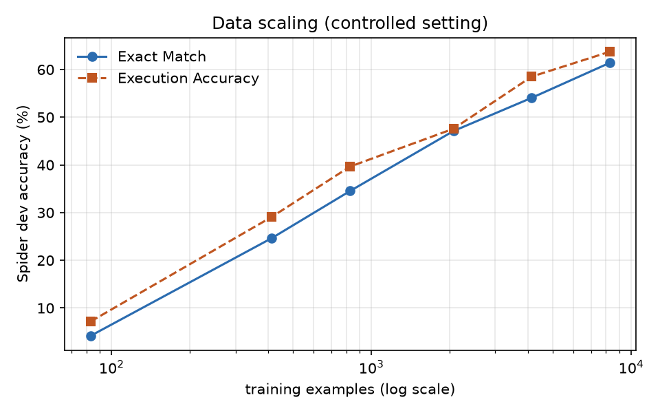
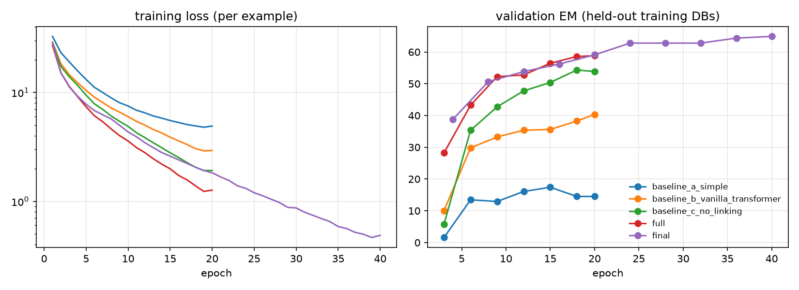
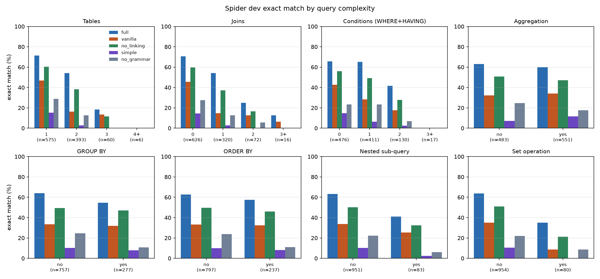
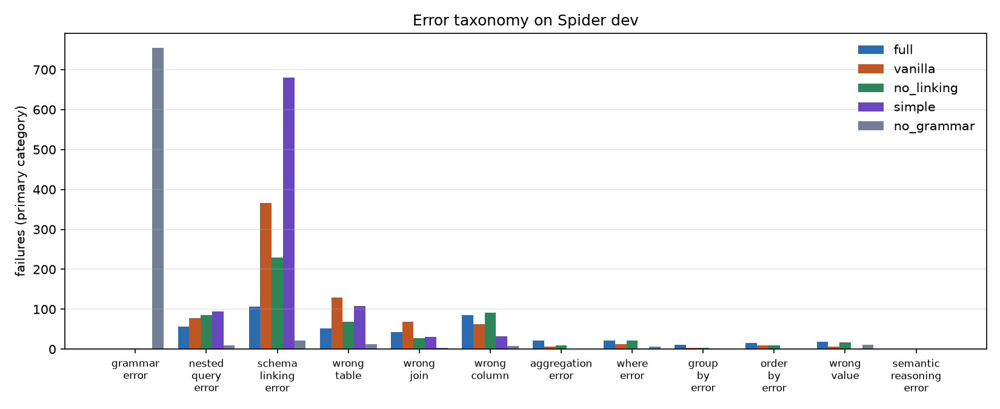
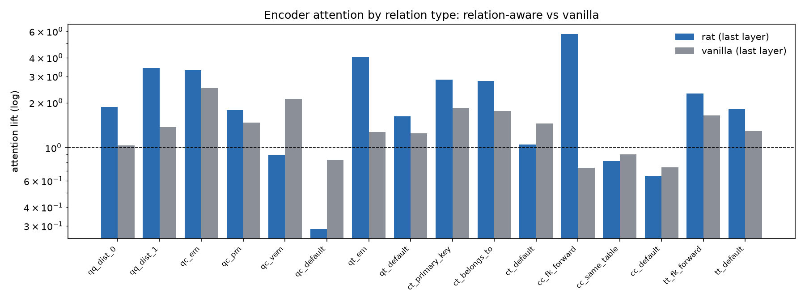
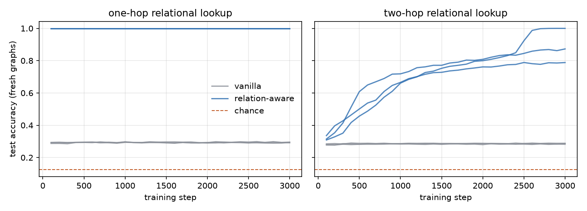

# Experiment results

Every table below is generated from saved metric files by `scripts/collect_results.py`, `scripts/run_error_analysis.py`, `scripts/run_join_inference.py`, `scripts/run_attention_analysis.py` and `scripts/official_eval_crosscheck.py`. All numbers are **our measurements**; the RAT-SQL paper's numbers are only in the research report, section 15.1.

## Main results

#### Main results (our measurements)

All numbers are measured by this repository on the Spider **dev** set (1,034 examples, 20 unseen databases) unless a Split column says test (2,147 examples, 40 unseen databases). Controlled setting (all rows except Final): BERT-small encoder, identical training budget and data; checkpoints selected on held-out *training* databases. SQL validity = fraction of predictions that execute without error.

| Model | Split | Exact Match (%) | EM 95% CI | Execution Accuracy (%) | EX 95% CI | SQL Validity (%) | Params | Train (min) |
|---|---|---|---|---|---|---|---|---|
| Baseline A: BiLSTM schema encoder + grammar decoder (no BERT, no RAT, no linking) | dev | 9.6 | [7.8, 11.3] | 10.0 | [8.2, 11.7] | 31.7 | 22,206,770 | 41.5 |
| Baseline B: vanilla transformer (no relation-aware attention) | dev | 33.1 | [30.4, 36.0] | 31.4 | [28.7, 34.3] | 54.7 | 37,056,562 | 53.4 |
| Baseline C: schema-aware RAT without schema linking | dev | 48.7 | [45.6, 51.7] | 53.0 | [49.7, 56.0] | 88.0 | 37,067,826 | 57.7 |
| FULL: BERT + RAT + schema linking + grammar decoding | dev | 61.4 | [58.4, 64.3] | 63.7 | [60.6, 66.5] | 92.4 | 37,067,826 | 51.8 |
| Final: FULL with BERT-medium, 40 epochs | dev | 64.9 | [62.0, 67.7] | 66.9 | [64.1, 69.9] | 90.0 | 49,677,362 | 101.3 |
| Final: FULL with BERT-medium, 40 epochs | test | 59.3 | [57.3, 61.5] | 63.4 | [61.4, 65.5] | 88.6 | 49,677,362 | 101.3 |

## Official evaluator cross-check

| Predictions | Examples | EM (ours) | EM (official) | EM agreement | EX (ours, strict) | EX (official test-suite exec.) | EX agreement |
|---|---|---|---|---|---|---|---|
| controlled FULL, dev | 1,034 | 61.41 | 61.41 | 100.0 % | 63.73 | 64.51 | 98.5 % |
| final model, dev | 1,034 | 64.89 | 64.89 | 100.0 % | 66.92 | 68.09 | 98.6 % |
| final model, test | 2,147 | 59.34 | 59.34 | 100.0 % | 63.44 | 64.28 | 98.9 % |

## Greedy vs beam search

_(beam-search evaluation not available)_

## Ablations

#### Ablations (our measurements)

All numbers are measured by this repository on the Spider **dev** set (1,034 examples, 20 unseen databases) unless a Split column says test (2,147 examples, 40 unseen databases). Controlled setting (all rows except Final): BERT-small encoder, identical training budget and data; checkpoints selected on held-out *training* databases. SQL validity = fraction of predictions that execute without error. ΔEM/ΔEX are differences to the FULL row; 95 % CIs from a paired bootstrap over dev examples (2,000 resamples) capture dev-set sampling noise but not training-seed variance.

| ID | Experiment | EM (%) | EX (%) | SQL valid (%) | Well-formed AST (%) | ΔEM (pts) | ΔEM 95% CI | ΔEX (pts) | ΔEX 95% CI | Params | Train (min) | Infer (ms/ex) |
|---|---|---|---|---|---|---|---|---|---|---|---|---|
| A | FULL: BERT + RAT + schema linking + grammar decoding | 61.4 | 63.7 | 92.4 | 100.0 | 0.0 | – | 0.0 | – | 37,067,826 | 51.8 | 22.98 |
| B | Baseline C: schema-aware RAT without schema linking | 48.7 | 53.0 | 88.0 | 99.8 | -12.7 | [-15.5, -10.0] | -10.7 | [-13.2, -8.3] | 37,067,826 | 57.7 | 27.43 |
| C | No n-gram (name) linking | 54.3 | 55.7 | 89.6 | 100.0 | -7.2 | [-9.9, -4.4] | -8.0 | [-10.6, -5.4] | 37,067,826 | 40.9 | 10.26 |
| D | No value (cell) linking | 58.3 | 60.5 | 88.6 | 100.0 | -3.1 | [-5.6, -0.8] | -3.2 | [-5.6, -0.8] | 37,067,826 | 37.2 | 10.15 |
| E | No relation-aware transformer (BERT output fed to decoder) | 31.8 | 32.2 | 54.6 | 100.0 | -29.6 | [-32.8, -26.3] | -31.5 | [-34.7, -28.2] | 33,897,010 | 31.4 | 9.89 |
| F | Baseline B: vanilla transformer (no relation-aware attention) | 33.1 | 31.4 | 54.7 | 100.0 | -28.3 | [-31.3, -25.4] | -32.3 | [-35.4, -29.2] | 37,056,562 | 53.4 | 23.63 |
| G | No foreign-key relations | 60.2 | 60.0 | 91.1 | 100.0 | -1.3 | [-3.9, +1.5] | -3.8 | [-6.2, -1.2] | 37,067,826 | 36.6 | 10.66 |
| H | No grammar constraints (unmasked action softmax) | 20.9 | 21.7 | 26.2 | 27.1 | -40.5 | [-43.7, -37.4] | -42.1 | [-45.2, -38.9] | 37,067,826 | 36.6 | 7.26 |
| I | BiLSTM instead of BERT (with RAT + linking) | 49.9 | 52.8 | 85.6 | 99.9 | -11.5 | [-14.4, -8.7] | -10.9 | [-13.6, -8.1] | 25,377,586 | 27.8 | 11.18 |
| J | Reduced training data (10%) | 34.5 | 39.6 | 83.4 | 99.9 | -26.9 | [-29.8, -23.9] | -24.1 | [-27.0, -21.0] | 37,067,826 | 11.5 | 10.36 |
| K | Coarse relation vocabulary (6 undirected relation types) | 56.3 | 57.9 | 86.7 | 100.0 | -5.1 | [-7.6, -2.6] | -5.8 | [-8.4, -3.2] | 37,058,354 | 36.8 | 9.75 |

#### Training-seed variance of the controlled FULL model (dev, our measurements)

| Seed | EM (%) | EX (%) | SQL valid (%) | Best epoch |
|---|---|---|---|---|
| 42 | 61.4 | 63.7 | 92.4 | 20 |
| 43 | 59.1 | 61.1 | 88.9 | 20 |

Difference (43 − 42): EM -2.3 pts (paired-bootstrap 95 % CI over dev examples [-4.5, +0.0]), EX -2.6 pts.

## Data scaling

#### Data scaling (our measurements)

All numbers are measured by this repository on the Spider **dev** set (1,034 examples, 20 unseen databases) unless a Split column says test (2,147 examples, 40 unseen databases). Controlled setting (all rows except Final): BERT-small encoder, identical training budget and data; checkpoints selected on held-out *training* databases. SQL validity = fraction of predictions that execute without error.

| Training data | Examples | EM (%) | EX (%) | SQL valid (%) | Epochs | Train (min) |
|---|---|---|---|---|---|---|
| 1% of training data | 83 | 4.2 | 7.2 | 53.0 | 200 | 4.3 |
| 5% of training data | 414 | 24.7 | 29.1 | 77.3 | 89 | 7.1 |
| 10% of training data | 828 | 34.5 | 39.6 | 83.4 | 63 | 11.5 |
| 25% of training data | 2,070 | 47.1 | 47.6 | 86.6 | 40 | 19.4 |
| 50% of training data | 4,140 | 54.1 | 58.5 | 87.6 | 28 | 26.9 |
| 100% of training data | 8,280 | 61.4 | 63.7 | 92.4 | 20 | 51.8 |

## Difficulty, clauses and complexity

#### EM / EX by Spider difficulty (dev, our measurements)

| Experiment | easy EM | medium EM | hard EM | extra EM | easy EX | medium EX | hard EX | extra EX |
|---|---|---|---|---|---|---|---|---|
| ablation_c_no_ngram_linking | 77.4 | 52.7 | 48.3 | 30.1 | 76.6 | 54.3 | 52.3 | 31.9 |
| ablation_d_no_value_linking | 76.2 | 60.3 | 44.8 | 40.4 | 79.4 | 62.8 | 49.4 | 38.0 |
| ablation_e_no_rat | 52.0 | 29.8 | 23.6 | 15.7 | 55.6 | 30.5 | 23.6 | 10.8 |
| ablation_g_no_foreign_keys | 83.5 | 61.4 | 48.9 | 33.7 | 82.7 | 62.3 | 45.4 | 34.9 |
| ablation_h_no_grammar | 42.3 | 18.8 | 10.9 | 4.8 | 40.3 | 20.8 | 12.6 | 5.4 |
| ablation_i_lstm_encoder | 75.8 | 46.4 | 39.1 | 31.9 | 77.4 | 50.0 | 43.7 | 33.1 |
| ablation_k_coarse_relations | 81.0 | 55.8 | 43.7 | 33.7 | 81.0 | 59.6 | 44.8 | 32.5 |
| baseline_a_simple | 21.4 | 8.1 | 5.2 | 0.6 | 24.2 | 7.0 | 5.2 | 1.8 |
| baseline_b_vanilla_transformer | 52.4 | 31.6 | 29.9 | 11.5 | 52.4 | 30.3 | 25.3 | 9.6 |
| baseline_c_no_linking | 68.5 | 49.5 | 39.7 | 26.5 | 73.4 | 53.8 | 43.1 | 30.7 |
| final | 83.9 | 67.7 | 52.9 | 41.6 | 82.3 | 72.0 | 56.9 | 41.0 |
| full | 82.7 | 62.6 | 48.9 | 39.8 | 82.7 | 65.9 | 51.7 | 42.2 |
| scaling_01pct | 11.7 | 1.8 | 3.5 | 0.0 | 17.3 | 4.5 | 4.0 | 2.4 |
| scaling_05pct | 50.4 | 18.8 | 19.0 | 7.8 | 54.4 | 24.2 | 21.8 | 12.0 |
| scaling_10pct | 58.5 | 31.8 | 27.0 | 13.9 | 61.7 | 38.8 | 30.5 | 18.7 |
| scaling_25pct | 76.2 | 45.1 | 33.3 | 23.5 | 74.6 | 47.8 | 36.2 | 18.7 |
| scaling_50pct | 76.2 | 56.5 | 39.1 | 30.1 | 78.2 | 62.8 | 41.4 | 35.5 |

Examples per level: easy=248, medium=446, hard=174, extra=166

#### Clause-level accuracy (Spider dev, gold queries containing the clause; our measurements)

| Clause | n | full | vanilla | no_linking | simple | no_grammar |
|---|---|---|---|---|---|---|
| SELECT | 1034 | 85.0 | 73.5 | 80.2 | 52.0 | 25.2 |
| WHERE | 478 | 75.3 | 53.8 | 56.1 | 25.9 | 26.2 |
| JOIN | 378 | 73.8 | 29.6 | 55.3 | 10.8 | 13.8 |
| GROUP BY | 271 | 79.7 | 62.7 | 79.0 | 49.4 | 12.2 |
| HAVING | 75 | 78.7 | 77.3 | 77.3 | 72.0 | 2.7 |
| ORDER BY | 231 | 77.5 | 73.6 | 75.8 | 51.5 | 13.0 |
| NESTED | 159 | 44.7 | 23.3 | 34.6 | 8.8 | 8.2 |
| AGGREGATION | 551 | 71.7 | 64.6 | 67.2 | 40.5 | 20.7 |

#### Accuracy by query complexity (Spider dev, our measurements)

| Feature | Bucket | n | full EM | full EX | vanilla EM | vanilla EX | no_linking EM | no_linking EX | simple EM | simple EX | no_grammar EM | no_grammar EX |
|---|---|---|---|---|---|---|---|---|---|---|---|---|
| Tables | 1 | 575 | 71.5 | 73.0 | 47.0 | 47.3 | 60.3 | 64.2 | 15.3 | 16.5 | 28.9 | 28.7 |
| Tables | 2 | 393 | 54.2 | 57.8 | 16.3 | 13.5 | 38.2 | 44.5 | 2.8 | 1.3 | 12.7 | 15.0 |
| Tables | 3 | 60 | 18.3 | 20.0 | 13.3 | 0.0 | 11.7 | 6.7 | 0.0 | 5.0 | 0.0 | 0.0 |
| Tables | 4+ | 6 | 0.0 | 0.0 | 0.0 | 0.0 | 0.0 | 0.0 | 0.0 | 0.0 | 0.0 | 0.0 |
| Joins | 0 | 626 | 70.6 | 72.7 | 45.5 | 45.7 | 59.6 | 63.6 | 14.4 | 15.2 | 27.5 | 27.6 |
| Joins | 1 | 320 | 54.1 | 56.2 | 14.7 | 11.2 | 37.2 | 42.8 | 2.8 | 1.2 | 12.5 | 14.4 |
| Joins | 2 | 72 | 25.0 | 30.6 | 12.5 | 4.2 | 16.7 | 18.1 | 0.0 | 4.2 | 5.6 | 6.9 |
| Joins | 3+ | 16 | 12.5 | 12.5 | 6.2 | 0.0 | 0.0 | 0.0 | 0.0 | 6.2 | 0.0 | 0.0 |
| Conditions (WHERE+HAVING) | 0 | 476 | 65.8 | 68.5 | 42.6 | 40.5 | 55.9 | 60.5 | 14.7 | 14.3 | 23.3 | 22.7 |
| Conditions (WHERE+HAVING) | 1 | 411 | 65.2 | 67.2 | 28.2 | 25.8 | 49.1 | 52.6 | 6.3 | 6.8 | 23.4 | 25.5 |
| Conditions (WHERE+HAVING) | 2 | 130 | 41.5 | 43.8 | 17.7 | 20.0 | 27.7 | 33.8 | 2.3 | 4.6 | 6.9 | 8.5 |
| Conditions (WHERE+HAVING) | 3+ | 17 | 0.0 | 0.0 | 0.0 | 0.0 | 0.0 | 0.0 | 0.0 | 5.9 | 0.0 | 0.0 |
| Aggregation | no | 483 | 63.1 | 64.2 | 32.1 | 27.5 | 50.7 | 51.8 | 7.2 | 7.0 | 24.6 | 24.0 |
| Aggregation | yes | 551 | 59.9 | 63.3 | 33.9 | 34.8 | 47.0 | 54.1 | 11.6 | 12.5 | 17.6 | 19.6 |
| GROUP BY | no | 757 | 63.9 | 65.1 | 33.6 | 31.6 | 49.4 | 52.7 | 10.2 | 10.7 | 24.6 | 25.6 |
| GROUP BY | yes | 277 | 54.5 | 59.9 | 31.8 | 31.0 | 46.9 | 53.8 | 7.9 | 7.9 | 10.8 | 10.8 |
| ORDER BY | no | 797 | 62.6 | 64.6 | 33.2 | 31.7 | 49.6 | 53.2 | 10.0 | 10.5 | 23.8 | 24.8 |
| ORDER BY | yes | 237 | 57.4 | 60.8 | 32.5 | 30.4 | 46.0 | 52.3 | 8.0 | 8.0 | 11.0 | 11.0 |
| Nested sub-query | no | 951 | 63.2 | 65.5 | 33.8 | 32.3 | 50.2 | 54.4 | 10.2 | 10.8 | 22.2 | 22.7 |
| Nested sub-query | yes | 83 | 41.0 | 43.4 | 25.3 | 21.7 | 32.5 | 37.3 | 2.4 | 0.0 | 6.0 | 9.6 |
| Set operation | no | 954 | 63.6 | 65.4 | 35.1 | 33.4 | 51.0 | 55.0 | 10.4 | 10.6 | 21.9 | 22.7 |
| Set operation | yes | 80 | 35.0 | 43.8 | 8.8 | 7.5 | 21.2 | 28.7 | 0.0 | 2.5 | 8.8 | 8.8 |

## Schema-graph join inference

#### Schema-graph join inference at serialisation time (Spider dev, our measurements)

| Model | Variant | EM (%) | EX (%) | SQL valid (%) | Rewritten queries |
|---|---|---|---|---|---|
| full | as decoded | 61.4 | 63.7 | 92.4 | 0 |
| full | + FK join inference | 62.8 | 66.6 | 98.6 | 156 |
| vanilla | as decoded | 33.1 | 31.4 | 54.7 | 0 |
| vanilla | + FK join inference | 37.5 | 48.9 | 94.0 | 530 |
| no_linking | as decoded | 48.7 | 53.0 | 88.0 | 0 |
| no_linking | + FK join inference | 50.9 | 57.8 | 97.1 | 200 |
| simple | as decoded | 9.6 | 10.0 | 31.7 | 0 |
| simple | + FK join inference | 10.4 | 20.6 | 90.9 | 709 |
| final | as decoded | 64.9 | 66.9 | 90.0 | 0 |
| final | + FK join inference | 65.7 | 69.9 | 96.4 | 169 |

## Attention analysis

#### Attention lift by relation type (1 = uniform attention; head-averaged; our measurements)

| Relation | Meaning | rat L1 | rat last | vanilla L1 | vanilla last |
|---|---|---|---|---|---|
| qq_dist_0 | question -> itself | 1.44 | 1.87 | 2.59 | 1.04 |
| qq_dist_1 | question -> next token | 1.29 | 3.42 | 2.44 | 1.38 |
| qc_em | question -> exactly-matched column | 1.98 | 3.30 | 2.87 | 2.51 |
| qc_pm | question -> partially-matched column | 3.57 | 1.79 | 1.56 | 1.48 |
| qc_vem | question -> value-matched column | 0.53 | 0.90 | 0.76 | 2.12 |
| qc_default | question -> unlinked column | 0.94 | 0.29 | 0.56 | 0.83 |
| qt_em | question -> exactly-matched table | 2.32 | 4.03 | 1.11 | 1.27 |
| qt_default | question -> unlinked table | 0.89 | 1.63 | 0.40 | 1.25 |
| ct_primary_key | column -> its table (PK) | 4.05 | 2.85 | 0.44 | 1.85 |
| ct_belongs_to | column -> its table | 1.82 | 2.79 | 0.79 | 1.77 |
| ct_default | column -> other table | 2.06 | 1.05 | 0.69 | 1.46 |
| cc_fk_forward | column -> FK target column | 1.35 | 5.75 | 1.00 | 0.73 |
| cc_same_table | column -> same-table column | 1.86 | 0.81 | 0.71 | 0.90 |
| cc_default | column -> unrelated column | 0.50 | 0.65 | 0.72 | 0.74 |
| tt_fk_forward | table -> FK-linked table | 1.38 | 2.31 | 0.62 | 1.65 |
| tt_default | table -> unrelated table | 4.45 | 1.81 | 0.80 | 1.30 |

## Synthetic relation experiment

| Task | Attention | Test accuracy (mean ± std over seeds) | Chance | Params |
|---|---|---|---|---|
| one_hop | relation-aware | 1.000 ± 0.000 | 0.125 | 72,584 |
| one_hop | vanilla | 0.293 ± 0.002 | 0.125 | 72,200 |
| two_hop | relation-aware | 0.887 ± 0.107 | 0.125 | 72,584 |
| two_hop | vanilla | 0.286 ± 0.003 | 0.125 | 72,200 |

3,000 training steps, 3 seeds, 12 nodes, 8 labels, 1,024 fresh test graphs.
Relation-free reference (simulated on 4,000 random graphs): predicting the most frequent label
among the other nodes scores **0.295** (one-hop) and **0.285** (two-hop) — the level vanilla
attention converges to, i.e. vanilla attention learns the best strategy available without
relation information. A 1,500-step run of the same experiment is kept in
`synthetic_relation_experiment_1500steps.md` (two-hop relation-aware: 0.751 ± 0.022).

## Error distribution

#### Primary error category (Spider dev failures, our measurements)

| Category | full | no_grammar | no_linking | simple | vanilla |
|---|---|---|---|---|---|
| grammar_error | 0 | 754 | 2 | 0 | 0 |
| nested_query_error | 56 | 9 | 86 | 94 | 78 |
| schema_linking_error | 107 | 22 | 229 | 680 | 366 |
| wrong_table | 52 | 12 | 68 | 108 | 129 |
| wrong_join | 43 | 4 | 28 | 30 | 69 |
| wrong_column | 85 | 8 | 91 | 32 | 63 |
| aggregation_error | 22 | 1 | 9 | 1 | 6 |
| where_error | 21 | 7 | 22 | 2 | 12 |
| group_by_error | 11 | 0 | 3 | 2 | 3 |
| order_by_error | 15 | 1 | 10 | 0 | 9 |
| wrong_value | 19 | 11 | 17 | 0 | 7 |
| semantic_reasoning_error | 1 | 0 | 0 | 0 | 0 |
| **total failures** | 432 | 829 | 565 | 949 | 742 |

## Plots

